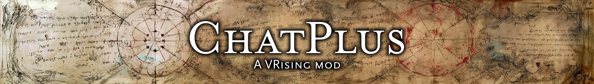

[](https://opensource.org/licenses/AGPL-3.0) []() [](https://patreon.com/FrykesFiddlings)

This is the repository for ChatPlus, coded by Fryke (fryke) on Discord.

ChatPlus is a V Rising client mod that replaces the vanilla chat with a movable, resizable window. It keeps per-channel colors, timestamps, input recall, command hotkeys, and a persistent log, and it hides the native chat window while it is active.

## Features

- **Custom chat window** - A movable, resizable, draggable window. Grab the dotted grip in a bottom corner to move it, drag the log or use the wheel to scroll, and let it fade after 15 seconds idle.
- **Channel tags** - Optional tags (such as `[G]`, `[L]`, `[C]`, `[W]`, `[S]`) show the channel on each line.
- **Timestamps** - Show or hide a timestamp on each line.
- **Colors** - Set the label and text color for each channel, plus your own name and message, plus admin names and admin messages. Each special color has an "Applies to" scope for Global, Local, Clan, and Whisper. A channel with a scope turned off falls back to the next color, then to the channel color.
- **Admin tag** - A player who is an admin shows an `[ADMIN]` tag after their name.
- **Copy** - While the chat box is focused, click a line to copy it with its timestamp. "Copy chat" copies the lines currently shown.
- **Input recall** - Up and Down cycle your sent lines, newest first. Recall survives restarts, up to 1000 lines.
- **Command hotkeys** - Bind a key or a Ctrl, Alt, Shift combination to a list of commands or messages. The entries fire in order to the current channel while the chat box is not focused. Each entry has an enable toggle.
- **Layout controls** - Set log opacity, input opacity, window position and size, and the clan HUD offset. A "Right side" button mirrors the layout.
- **Persistent history** - The last 1000 chat lines are saved and restored on the next session.
- **Vanilla toggle** - Press F6 to swap between ChatPlus and the vanilla chat.
- **Client-side only** - Install it on your client. It does not need a server install and does not change other players.

## Help

The in-game Help page (open it from the window) explains chat, channels, recall, hotkeys, copy, admins, and layout.

- Enter focuses the box and sends. An empty Enter or Escape defocuses without closing the window.
- F6 swaps between ChatPlus and the vanilla chat.
- While the box is focused, the keyboard is locked to chat so typing cannot trigger game actions.

## Installation

1. Install [BepInExPack V Rising](https://thunderstore.io/c/v-rising/p/BepInEx/BepInExPack_V_Rising/) to your V Rising client folder.
2. Place `ChatPlus.dll` in `VRising/BepInEx/plugins/`.
3. Start the game. The ChatPlus window replaces the vanilla chat.

## Data Storage

Settings and history are stored on your client under `BepInEx/config/ChatPlus/`.

| File | Contents |
|---|---|
| `settings.json` | Window layout, colors, opacities, display toggles, and hotkeys |
| `chat_history.json` | The last 1000 chat lines |
| `input_history.json` | Your sent lines for input recall |

Settings save shortly after a change. History saves every 30 seconds and on exit.

## Building from Source

```bash
dotnet build
```

The built DLL is at `bin/Debug/net6.0/ChatPlus.dll`.

## Changelog

### 1.0.0
- First public release.

## License

This project is licensed under AGPL-3.0.

## Attribution

Portions of code and design patterns in this project were inspired by or adapted from the following projects:

  - Raphael, Lord of Wisdom <https://github.com/KDavidP1987/Raphael-Lord-of-Wisdom>
    Licensed under MIT
    Baseline for the client chat capture pipeline, native chat takeover, input suppression, and the whisper and player targeting concepts.
  - Eclipse <https://github.com/mfoltz/Eclipse>
    Licensed under CC BY-NC 4.0
    Origin of the inbound client chat pump and the raw chat network-event send used for whispers.

This is an independent project. It is not a fork or a modification of the above projects, but portions of code and design patterns were adapted as noted above.

Full third-party license texts are in [`THIRD-PARTY-NOTICES.md`](THIRD-PARTY-NOTICES.md).
